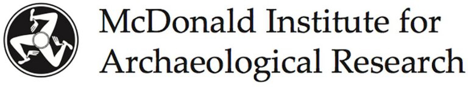
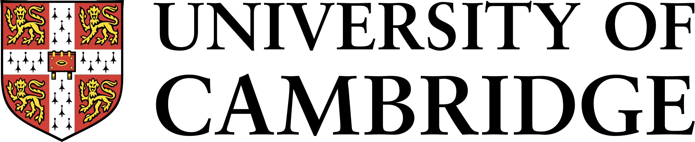

# Research in Progress Meeting 2026

::: {.callout-important icon=false} 

## Important dates
25 September -- Deadline for [abstract submission](https://forms.gle/4WL3oqG4vHh1F7ti7) (there won't be any extension!)  
23 October -- Announcement of abstracts decisions  
30 October -- Announcement of program  
13 November -- Registration closes for in person attendees participants  
27 November -- Research in Progress Meeting  

::: 

## Call for Papers

:::: {.column-margin}
Hosted at:  
&nbsp;  
  
&nbsp;  
 
&nbsp;  
&nbsp;  

Organised by:  
Bruna Pelegrín-Garcia  
Sarah Grabowski  
Mélissa Morel

::::

The [Historical Metallurgy Society](https://historicalmetallurgy.org/) invites submissions for its annual Research in Progress Meeting, to be held on *27 November 2026* in a hybrid format. The meeting will take place at the McDonald Institute for Archaeological Research, University of
Cambridge, with online participation also available for those unable to attend in person.

This year, we have chosen a hybrid format to combine the flexibility and accessibility of remote participation with the valuable opportunities for face-to-face discussion, collaboration, and networking that are central to our community. While online attendance will remain fully available for those unable to travel, we warmly encourage participants to join us in Cambridge if possible.

The Research in Progress Meeting provides a friendly forum for presenting ongoing research in historical and archaeological metallurgy. We welcome papers on any aspect of the production, use, and significance of metals in the past, including approaches from archaeological science, typological studies, and theoretical perspectives. Topics may include (but are not limited to):

* Mining and ore procurement strategies
* Smelting practices and technologies
* Smithing techniques, refining, alloying, and metalworking processes
* Use, reuse, recycling, repair, and deposition of metal objects
* Experimental approaches to metallurgical practices
* Production organisation, technological traditions, innovations, and cross-craft interactions
* Trade, exchange, provenance, and circulation of metal stock and objects
* Social, economic, and cultural significance of metals
* Conservation and heritage science of metal artefacts
* Fieldwork and recovery techniques for metal artefacts and metallurgical remains

We warmly encourage submissions from diverse chronological and geographical contexts, and especially welcome contributions from students, early career researchers, and those working outside academia. Contributors are encouraged to submit work in progress as well as completed research.

## Submission and registration

Abstracts (up to 200 words) can be submitted until *Friday, 25 September 2026* via the [submission form](https://forms.gle/4WL3oqG4vHh1F7ti7). Please note that there won't be an extension of the submission deadline. 

A registration form for all participants, with payment details for in-person attendance, will follow shortly.

## Format of contributions

* Full presentations (in person or online): 15 minutes + 5 min for questions
* Poster presentations (in person or online): 5 minutes flash talk

For participants attending in person, posters will also be displayed in printed format at the McDonald Institute for Archaeological Research.

## Fees

A participation fee of *£20* will be charged to *in-person participants* to cover the cost of lunch and refreshments provided during the coffee breaks. If the participation fee would present a financial barrier, please get in touch. We are committed to making the congress as accessible as possible and will consider requests for a fee waiver on a case-by-case basis.

<!--
The event is open for everyone irrespective of their HMS membership status. Participation is free of charge. Please register for the event between 1^st^ of September and 24^th^ of November using the [registration form](https://forms.gle/dzQemocN3TtX6LhF7). The link to the meeting room will be displayed once you successfully registered.  
-->

The programme and any updates will be announced here and circulated by email. Please contact the organising committee (<hms.rip2026@outlook.com>) for any questions and general inquiries. 

We look forward to receiving your contributions and welcoming you to the HMS Research in Progress Meeting 2026!

<!--
## Programme

[Time zone conversions:  
Eastern Time (USA) = UK -5  
Central Europe = UK +1  
India = UK +5:30  
Japan = UK +9  
You can convert to your local time zone with, e.g., [timeanddate.com](https://www.timeanddate.com/worldclock/converter.html?iso=20251128T100000&p1=136)]{.aside}

Presentations will be 15 min + 5 min discussion or 6 min + 4 min discussion.  

Abstracts can be found in the [abstract repository](abstracts.qmd) or [downloaded as pdf](assets/HMS-RiP2025_Abstracts.pdf). 

| Time (UK) | Contribution |
|------|----------------|
|10:00 | Welcome |
|10:10 | Sébastien Clouet:   [Bồng Miêu Gold Mine: Technological evolution and colonial adaptation in Southeast Asia](abstracts/2025-1.qmd) |
...
|11:40 | *Break* |
...
|16:00 | Awards announcement, closing|
-->

## Code of conduct
All participants at the Research in Progress Meetings agree to conduct themselves in a professional and appropriate manner and to ensure that all can enjoy a harassment-free event. The workshop organisers are dedicated to providing an inclusive, respectful, safe, friendly, and welcoming online meeting for all participants.

We do not tolerate disruptive or disrespectful behaviour, personal messages, images, or interactions by any participant, in any form, at any aspect of the program including business and social activities, regardless of location. 

Photography, video, recording or screen-captures of session content or presentations in any format are prohibited unless this right is granted on the slides of the respective presentation. We encourage everyone to assist in creating a welcoming and safe environment. 

If a participant engages in harassing behaviour, the event organisers may take any action they deem appropriate, including warning the offender and/or expulsion from the event. If you are being harassed, if you notice that someone else is being harassed, or have any other concerns, please contact one of the organisers immediately. 

We value your attendance and want the Research in Progress Meeting 2026 to be a safe place for everybody. 

## Contact
Please contact the organisers for any inquiries about the meeting via <hms.rip2026@outlook.com>.
